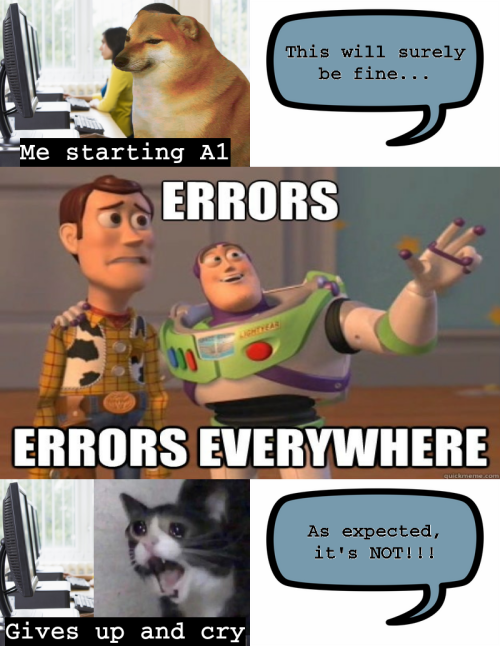

# Welcome to my website!


## Quick facts about me
* I am not a stats major
* I am on my last semester of uni
* I like data (kind of)

*So, this meme sums me up in a nutshell pretty well*


## YAM (Yet Another Meme)
This is the meme I created using the ```R``` package <a href = "https://cran.r-project.org/web/packages/magick/vignettes/intro.html"> magick</a>.



Below outlines the code I used to develop the meme

```
library(magick)

#pictures used in the meme
crycat <- image_read("https://en.meming.world/images/en/thumb/e/e2/Crying_Cat_screaming.jpg/300px-Crying_Cat_screaming.jpg") %>%
  image_flop() %>%
  image_scale(250)

mid_pic <- image_read("https://miro.medium.com/max/625/1*6l8213uiAPiL6Qu00iDWWQ.jpeg") %>%
  image_scale("800x500!")

sadge <- image_read("https://static.wikia.nocookie.net/floppapedia-revamped/images/c/c5/CheemsOG.png/revision/latest?cb=20210928184652") %>% 
  image_scale(400)

#background image of the meme
bg_1 <- image_read("https://betasms.com/wp-content/uploads/2020/09/photodune-312528-college-students-in-a-computer-lab-s.jpg") %>%
  image_scale(400)

dialoguebox <- image_read("https://i.dlpng.com/static/png/6868246_preview.png") %>%
  image_resize("400x267!") 

#picture part of meme
top_pic <- image_composite(bg_1, sadge, offset = "+80+0") %>% 
  image_annotate("Me starting A1", size = 40, color = "white", font = "Courier", 
                 gravity = "south", boxcolor = "black", weight = 700)

bottom_pic <- image_composite(bg_1, crycat, gravity = "northeast") %>%
  image_annotate("Gives up and cry", size = 40, color = "white", font = "Courier", 
                 gravity = "south", boxcolor = "black", weight = 700)

#text part of meme
top_text <- image_blank(width = 400, height = 267, color = "white") %>%
  image_annotate(text = "This will surely\nbe fine...", size = 30, color = "black", 
                 font = "Courier", gravity = "north", location = "+0+65", 
                 strokecolor = "black") %>%
  image_transparent(color = "white")

top_text <- image_composite(dialoguebox, top_text) 

bottom_text <- image_blank(width = 400, height = 267, color = "white") %>%
  image_annotate(text = "As expected,\nit's NOT!!!", size = 30, color = "black", 
                 font = "Courier", gravity = "north", location = "+0+65", 
                 strokecolor = "black") %>%
  image_transparent(color = "white")

bottom_text <- image_composite(dialoguebox, bottom_text) 

#combined together
top_compiled <- c(top_pic, top_text) %>%
  image_append()

bottom_compiled <- c(bottom_pic, bottom_text) %>%
  image_append()

#final combination
meme <- image_append(c(top_compiled, mid_pic, bottom_compiled), stack = TRUE) %>%
  image_scale(500)

#saving meme
image_write(meme, "my_meme.png")
```

### Inspiration behind the meme

A short story about how I came up with the idea behind this meme is:
1. I always liked self-deprecating memes about programmers and coding (even without much programming experience, the memes are somehow still relatable and funny).
2. Having a direction to go (which was the self-deprecation theme) and having found a <a href = "https://starecat.com/doge-coding-python-synthax-error/">meme format</a> that suits what I had in mind, I opened RStudio to execute my meme.
3. Turns out the programming deity really did hate me (jk) and my nightmares turned into reality (problems with the ```image_annotate()``` function).
4. So, I added some dialogue boxes into my meme to express what was in my thoughts.
5. That's how I came up with this meme!

